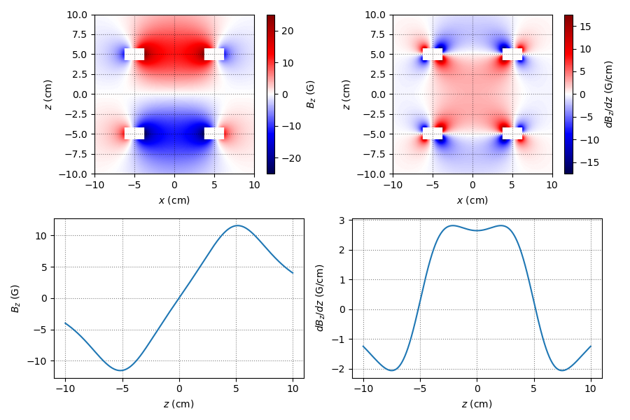

# torc

`torc` is a Python library for computing magnetic fields and gradients from
current-carrying coils — loops, straight wires, round coils, and racetrack coils of
rectangular cross-section — positioned and oriented arbitrarily in 3D space.

Finite cross-section conductors are approximated by distributing multiple idealised
1D current elements through the cross-section. Loop fields are computed analytically
using complete elliptic integrals; straight wire fields use the Biot–Savart result
for a finite wire; arcs and curved segments are approximated as sequences of straight
segments.

All quantities are in SI units (metres, amps, tesla). Convenience constants for
common unit conversions are included.

**[Read the docs on ReadTheDocs](https://python-torc.readthedocs.io)**
| [PyPI](https://pypi.org/project/torc/)
| [GitHub](https://github.com/chrisjbillington/torc)

## Installation

```bash
pip install torc
```

## API overview

| Class | Description |
|---|---|
| `Loop` | Ideal current loop (thin wire) |
| `Line` | Finite straight wire |
| `Arc` | Circular arc segment |
| `RoundCoil` | Cylindrical coil with rectangular cross-section |
| `RacetrackCoil` | Racetrack-shaped coil with rectangular cross-section |
| `StraightSegment` | Straight bus-bar segment |
| `CurvedSegment` | Curved bus-bar segment |
| `CoilPair` | Symmetric Helmholtz or anti-Helmholtz pair of any coil type |
| `Container` | Named collection of coils; sums fields from all children |

All objects expose `.B(r, I)` for the field vector at position `r` and `.dB(r, I, s)`
for the directional derivative along `s`. Positions vectors `r` can be arrays with first
dimension of lenfth 3 (for x, y, and z) and arbitary other dimensions, or can be
3-tuples (x,y,z) where x,y, and z are numpy arrays that will be subject to broadcasting,
for evaluating fields over grids.

## Examples

### Anti-Helmholtz coilpair

This example shows constructing a coilpair in anti-Helmholtz configuration, and
evaluating and plotting fields and gradients along lines and on a grid.



```python
import matplotlib.pyplot as plt
import numpy as np

from torc import RoundCoil, CoilPair, Z, cm, gauss, gauss_per_cm

R_inner = 4 * cm
R_outer = 6 * cm
separation = 10 * cm
height = 1 * cm

# A pair of round coils in anti-Helmholtz configuration:
coils = CoilPair(
    coiltype=RoundCoil,
    r0=(0, 0, 0),  # centred at the origin
    n=Z,  # normal direction is +Z
    separation=separation,
    height=height,
    inner_radius=R_inner,
    outer_radius=R_outer,
    num_turns=100,
    parity='anti-helmholtz',
)

def plot_2d_field_and_gradient():
    # Compute the field and z gradient for current I = 1A in a 2D x-z plane:

    # Construct grid - first dimension will be z and second will be x, so that when we
    # imshow() the 2D results, the z direction will be the vertical direction:
    x = np.linspace(-10 * cm, 10 * cm, 256)[np.newaxis, :]
    y = 0
    z = np.linspace(-10 * cm, 10 * cm, 256)[:, np.newaxis]

    # Compute B field on the grid
    B = coils.B((x,y,z), I=1)

    # Compute z derivative of B on the grid
    dB_dz = coils.dB((x,y,z), s=Z, I=1)

    # Mask out areas inside or within 0.25cm of the coils:
    d_mask = 0.25 * cm
    mask = (
        (abs(x) > R_inner - d_mask)
        & (abs(x) < R_outer + d_mask)
        & (abs(z) > separation / 2 - height / 2 - d_mask)
        & (abs(z) < separation / 2 + height / 2 + d_mask)
    )
    B[:, mask] = 0
    dB_dz[:, mask] = 0

    # Extract components:
    Bx, By, Bz = B
    dBz_dz, dBy_dz, dBz_dz = dB_dz

    # Bz 2D plot
    plt.subplot(221)
    plt.imshow(
        Bz / gauss,
        extent=[x.min() / cm, x.max() / cm, z.min() / cm, z.max() / cm],
        origin='lower',
        cmap='seismic',
        vmin=-abs(Bz / gauss).max(),
        vmax=abs(Bz / gauss).max(),
    )
    plt.grid(True, color='k', linestyle=":", alpha=0.5)
    plt.xlabel('$x$ (cm)')
    plt.ylabel('$z$ (cm)')
    plt.colorbar(label='$B_z$ (G)')

    # dBz_dz 2D plot
    plt.subplot(222)
    plt.imshow(
        dBz_dz / gauss_per_cm,
        extent=[x.min() / cm, x.max() / cm, z.min() / cm, z.max() / cm],
        origin='lower',
        cmap='seismic',
        vmin=-abs(dBz_dz / gauss_per_cm).max(),
        vmax=abs(dBz_dz / gauss_per_cm).max(),
    )
    plt.grid(True, color='k', linestyle=":", alpha=0.5)
    plt.xlabel('$x$ (cm)')
    plt.ylabel('$z$ (cm)')
    plt.colorbar(label='$dB_z/dz$ (G/cm)')

def plot_1d_field_and_gradient():
    z = np.linspace(-10 * cm, 10 * cm, 1024)

    # Compute B field on the z axis for current I = 1A 
    B = coils.B((0, 0, z), I=1)

    # Compute z derivative of B on the z axis for current I = 1A 
    dB_dz = coils.dB((0, 0, z), s=Z, I=1)

    # Extract components:
    Bx, By, Bz = B
    dBz_dz, dBy_dz, dBz_dz = dB_dz

    # Plot Bz and dBz_dz:
    plt.subplot(223)
    plt.plot(z / cm, Bz / gauss)
    plt.grid(True, color='k', linestyle=":", alpha=0.5)
    plt.xlabel('$z$ (cm)')
    plt.ylabel('$B_z$ (G)')

    plt.subplot(224)
    plt.plot(z / cm, dBz_dz / gauss_per_cm)
    plt.grid(True, color='k', linestyle=":", alpha=0.5)
    plt.xlabel('$z$ (cm)')
    plt.ylabel('$dB_z/dz$ (G/cm)')


# Calculate fields/gradients and show plots:
plt.figure(figsize=(9, 6))
plot_2d_field_and_gradient()
plot_1d_field_and_gradient()
plt.tight_layout()
plt.savefig('anti-helmholtz-plots.png')
plt.show()

# Display a 3D rendering of the coils:
coils.show()
```

### Multi-coil transport assembly

`torc` can model assemblies of many coils. The example shown below, the code for which
is in `examples/transport-assembly.py` constructs an assembly of coils for magnetic
transport in a cold-atom experiment:


