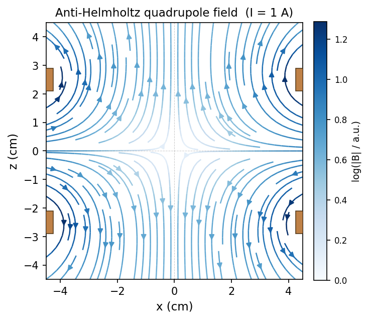
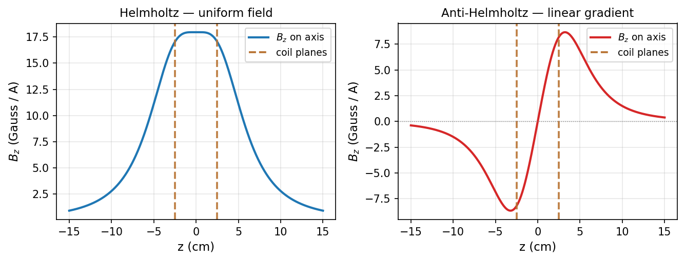

# torc

`torc` is a Python library for computing magnetic fields and gradients from
current-carrying coils — loops, straight wires, round coils, and racetrack coils of
rectangular cross-section — positioned and oriented arbitrarily in 3D space.

Finite cross-section conductors are approximated by distributing multiple idealised
1D current elements through the cross-section. Loop fields are computed analytically
using complete elliptic integrals; straight wire fields use the Biot–Savart result
for a finite wire; arcs and curved segments are approximated as sequences of straight
segments.

All quantities are in SI units (metres, amps, tesla). Convenience constants for
common unit conversions are included.

**[Read the docs on ReadTheDocs](https://python-torc.readthedocs.io)**
| [PyPI](https://pypi.org/project/torc/)
| [GitHub](https://github.com/chrisjbillington/torc)

## Installation

```bash
pip install torc
```

## Examples

### Helmholtz and anti-Helmholtz coil pairs

Two coils driven in the same direction (Helmholtz configuration) produce a highly
uniform field; opposite currents (anti-Helmholtz) produce a linear quadrupole
gradient — the standard magnetic trap geometry for cold-atom experiments.

```python
import numpy as np
from torc import RoundCoil, CoilPair, Z, cm, mm, gauss_per_cm

R = 5 * cm  # coil radius

common = dict(
    coiltype=RoundCoil,
    r0=(0, 0, 0),
    n=Z,
    separation=R,           # Helmholtz-ratio spacing
    height=8 * mm,
    inner_radius=R * 0.85,
    outer_radius=R * 1.15,
    num_turns=100,
)

helmholtz = CoilPair(parity='helmholtz', **common)
anti      = CoilPair(parity='anti-helmholtz', **common)

# Field at the centre for each configuration (1 A)
print(helmholtz.B((0, 0, 0), I=1.0))   # ≈ (0, 0, 0.018) T

# Axial gradient for the quadrupole
dBdz = anti.dB((0, 0, 0), I=1.0, s='z')
print(f"dBz/dz = {dBdz[2] / gauss_per_cm:.2f} G/cm/A")
```

The streamplot below shows the quadrupole field of the anti-Helmholtz pair in the
xz plane (copper rectangles mark the coil cross-sections):



The on-axis field profiles for both configurations:



### Multi-coil transport assembly

`torc` can model assemblies of many coils. The example below recreates the
magnetic transport coils from a cold-atom experiment (run `python example.py`
to launch the interactive 3D viewer):

```python
from torc import RoundCoil, CoilPair, Container, Z, mm, inch, COPPER

MOT = CoilPair(
    coiltype=RoundCoil,
    r0=(0, 0, 0),
    n=Z,
    separation=2 * 30.5e-3,      # 28 mm inner edge + half height
    height=0.3 * inch,
    inner_radius=1.595 * inch,
    outer_radius=2.375 * inch,
    num_turns=33,
    parity='anti-helmholtz',
    name='MOT',
)

print(f"MOT coil centre field: {MOT.B((0,0,0), I=1.0)}")
MOT.show(color=COPPER)           # interactive 3D rendering (requires pyqtgraph)
```


## Requirements

- `numpy`
- `scipy`
- `pyqtgraph` and `PySide6` (only for 3D visualisation via `.show()`)

## API overview

| Class | Description |
|---|---|
| `Loop` | Ideal current loop (thin wire) |
| `Line` | Finite straight wire |
| `Arc` | Circular arc segment |
| `RoundCoil` | Cylindrical coil with rectangular cross-section |
| `RacetrackCoil` | Racetrack-shaped coil with rectangular cross-section |
| `StraightSegment` | Straight bus-bar segment |
| `CurvedSegment` | Curved bus-bar segment |
| `CoilPair` | Symmetric Helmholtz or anti-Helmholtz pair of any coil type |
| `Container` | Named collection of coils; sums fields from all children |

All objects expose `.B(r, I)` for the field vector at position `r` and `.dB(r, I, s)`
for the directional derivative along `s`. Positions and field components are arrays,
so vectorised evaluation over grids is straightforward.
